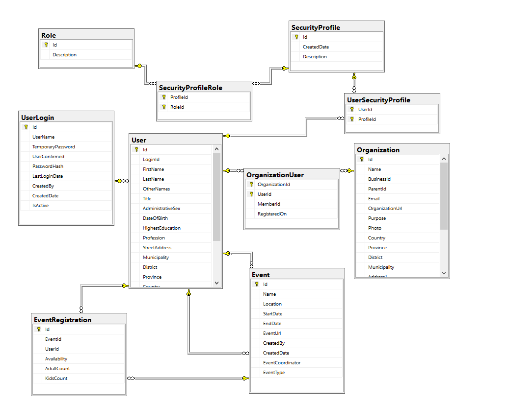

# UnitedNepali Database

The initial database schema description for the major domain entities are:

## Login 
**UserLogin** table stores the user login information
This table will be related to the **User** table to get the user related informations.

## User Management

**User** is the master table for the user personnel information
**Roles** table holds the all available roles to access different functionality of the system
**SecurityProfile** is the authorization previlege, that can be created by Administrator with specific roles
**UserSecurityProfile** is the record of the users for their specific profiles

## Organization Management

**Organization** is the master table for the organization level details
**OrganizationUser** will keep track of the different users, association with particular organization

## Events Management
**Event** is the master table for recording any events
**EventRegistration** will keep track of the user coming in a particular event

## Database Schema v1.0
The following snapshot shows the first version of the Schema:

# Database Information 

**Postgres** is the open source relational database. You can find more about this [here !!!](https://www.postgresql.org/)
**pgAdmin4** is the database management tool, which might ease to design and view the tables/relations.

