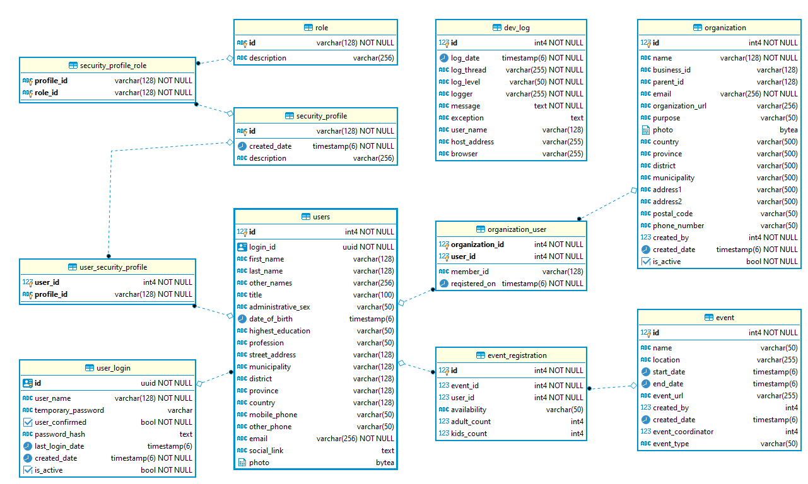

# UnitedNepali Database

The initial database schema description for the major domain entities are:  

## Login 
**user_login** stores the user login information  

## Role Management
**role** holds the available access functionalities for various features in the system  
**security_profile** is the authorization privileges (such as Admin, User, Manager), that can be created by Administrator
**security_profile_role** is the mapping, or the roles that is assigned to each created security profile

## User Management
**users** holds the master user personnel information. It is referenced to login table  
**user_security_profile** records the profile which is assigned for the created users

## Organization Management
**organization** holds the master organization level details  
**organization_user** will keep track of the different users, association with particular organization  

## Events Management
**event** is the master table for recording any events  
**event_registration** will keep track of the user coming in a particular event  

### Database Schema v1.0
The following snapshot shows the first version of the Schema:  

  

# Design Discussions
**Organization based Roles**
Roles are the application features to be controlled and currently, we provide same roles to all organization.
In future, if needed, we can enhance the feature by introducing **OrganizationRoles** table to limit each organization with specific roles.

**Organization based SecurityProfiles**
SecurityProfiles are the authorization given with certain roles for specific users. Currently, we have application level security profile. 
In futuer, if needed, we can enhance the feature by introducing **OrganizationSecurityProfile** table which will store the specific organization's profiles only,
and these is not shared with other organizations

# Database Information 

**Postgres** is the open source relational database. You can find more about this [here !!!](https://www.postgresql.org/)  
**pgAdmin4** is the database management tool, which might ease to design and view the tables/relations. 

# Local development using docker

If using the project's `docker-compose` setup, the container runs on `localhost:5432`, connect to it using your favourite Postgres client.
Available open source clients:
* [pgAdmin](https://www.pgadmin.org/)
* [Postico](https://eggerapps.at/postico/) _Mac OSX only_
* [DBeaver](https://dbeaver.io/)

Credentials are supplied in `docker/.env` file
